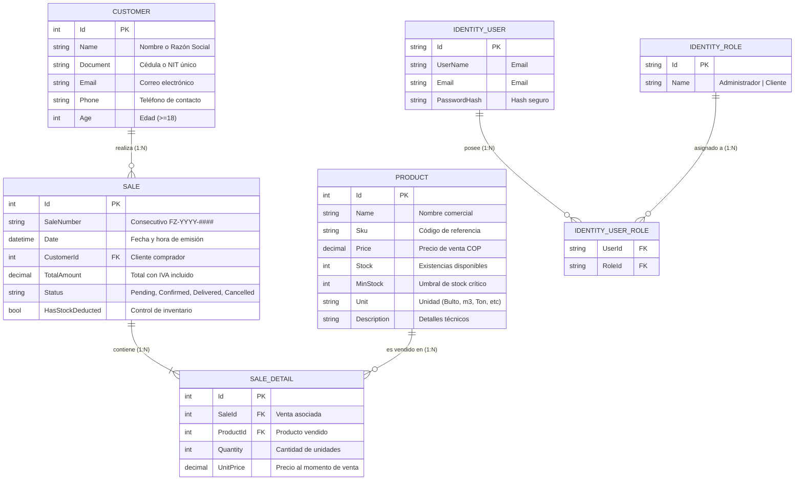

# 🏗️ FIRMEZA - Sistema ERP & Portal de Materiales de Construcción

> **Plataforma web integral de comercio, inventario y facturación para la industria de la construcción.**  
> Desarrollado con **ASP.NET Core 10 (Web API + Clean Architecture)**, base de datos **PostgreSQL 15**, y frontend en **Angular 22** con estética futurista **HUD Industrial**.

---

## 📋 Tabla de Contenidos

1. [Visión General y Separación de Roles](#-visión-general-y-separación-de-roles)
2. [Arquitectura del Sistema](#-arquitectura-del-sistema)
3. [Diagrama Entidad-Relación (Mermaid)](#-diagrama-entidad-relación-er)
4. [Diagrama de Clases y Arquitectura Limpia (Mermaid)](#-diagrama-de-clases-y-servicios)
5. [Carga Masiva de Datos Desnormalizados (EPPlus)](#-carga-masiva-de-datos-desnormalizados-epplus)
6. [Exportaciones e Informes PDF / Excel (QuestPDF)](#-exportaciones-y-recibos-en-pdf)
7. [Guía de Despliegue y Ejecución](#-guía-de-despliegue-y-ejecución)
   - [Opción A: Docker Compose (Recomendada)](#opción-a-todo-con-docker-compose)
   - [Opción B: Base de datos en Docker y App Local](#opción-b-base-de-datos-en-docker-y-app-local)
8. [Matriz de Endpoints de la API](#-matriz-de-endpoints-api)
9. [Pruebas Unitarias (xUnit)](#-pruebas-unitarias-xunit)
10. [Credenciales por Defecto](#-credenciales-de-acceso)

---

## 👥 Visión General y Separación de Roles

El sistema implementa una **separación estricta de responsabilidades** tanto en la API como en la interfaz gráfica:

```
                  ┌──────────────────────────────────────────────┐
                  │          Landing Page Pública (/home)        │
                  │   Catálogo de presentación e inicio/registro │
                  └──────────────────────┬───────────────────────┘
                                         │ Autenticación JWT
                    ┌────────────────────┴────────────────────┐
                    ▼                                         ▼
   ┌─────────────────────────────────┐       ┌─────────────────────────────────┐
   │        ROL: ADMINISTRADOR       │       │          ROL: CLIENTE           │
   ├─────────────────────────────────┤       ├─────────────────────────────────┤
   │ • Dashboard de telemetría y KPIs│       │ • Catálogo interactivo (/tienda)│
   │ • Terminal Punto de Venta (POS) │       │ • Carrito con cálculo de IVA    │
   │ • Gestión de Productos y Stock  │       │ • Checkout de cotización/compra │
   │ • Directorio de Clientes y NIT  │       │ • Mis Pedidos y Comprobantes    │
   │ • Historial Global de Ventas    │       │ • Descarga directa de Recibo PDF│
   │ • Carga masiva Excel (EPPlus)   │       │                                 │
   │ • Exportación Excel y PDF       │       │ * Prohibido acceso a módulos    │
   │ • Alertas de stock crítico      │       │   administrativos y métricas    │
   └─────────────────────────────────┘       └─────────────────────────────────┘
```

---

## 🏛️ Arquitectura del Sistema

El backend sigue los principios de **Clean Architecture (Onion Architecture)**, dividiendo la solución en 4 capas desacopladas:

- **`Firmeza.Domain`**: Entidades centrales (`Product`, `Customer`, `Sale`, `SaleDetail`), enumeraciones (`SaleStatus`), reglas de negocio y cálculo impositivo puro (`InventoryCalculator`, `SaleStatusRules`) sin dependencias externas.
- **`Firmeza.Application`**: Casos de uso, interfaces de servicios (`IExcelImportService`, `IExportService`, `IReceiptService`, `ISaleService`, `IProductService`, `ICustomerService`, `IEmailService`), DTOs de transferencia y contratos.
- **`Firmeza.Infraestructure`**: Acceso a datos (`ApplicationDbContext` en PostgreSQL), persistencia, autenticación JWT, implementaciones concretas de importación (`ExcelImportService` con EPPlus), exportación (`ExportService`), generación de PDF (`ReceiptService` con QuestPDF) y mensajería SMTP (`SmtpEmailService`).
- **`Firmeza.Web`**: Capa de presentación HTTP REST (`Controllers/Api`), filtros de autorización por rol, configuración de DI y middlewares.
- **`Firmeza.Tests`**: Suite de pruebas unitarias xUnit automatizadas.

---

## 🗄️ Diagrama Entidad-Relación (ER)



---

## 🧩 Diagrama de Clases y Servicios

```mermaid
classDiagram
    direction TB

    namespace Domain {
        class Product {
            +int Id
            +string Name
            +string Sku
            +decimal Price
            +int Stock
            +int MinStock
            +string Unit
        }
        class Customer {
            +int Id
            +string Name
            +string Document
            +string Email
            +string Phone
            +int Age
        }
        class Sale {
            +int Id
            +string SaleNumber
            +DateTime Date
            +int CustomerId
            +decimal TotalAmount
            +SaleStatus Status
            +List~SaleDetail~ Details
        }
        class SaleDetail {
            +int Id
            +int SaleId
            +int ProductId
            +int Quantity
            +decimal UnitPrice
        }
        class InventoryCalculator {
            +SplitTaxInclusive(total) TaxBreakdown
        }
        class SaleStatusRules {
            +CanTransitionTo(current, target) bool
        }
    }

    namespace Application {
        class IExcelImportService {
            <<interface>>
            +ImportFromStreamAsync(stream) ExcelImportResultDto
            +GenerateSampleTemplate() byte[]
        }
        class IExportService {
            <<interface>>
            +ExportProductsToExcelAsync() byte[]
            +ExportProductsToPdfAsync() byte[]
            +ExportCustomersToExcelAsync() byte[]
            +ExportSalesToExcelAsync() byte[]
            +ExportSalesToPdfAsync() byte[]
        }
        class IReceiptService {
            <<interface>>
            +GenerateReceiptPdf(Sale sale) byte[]
            +SaveReceiptToDisk(Sale sale, byte[] pdf, string path) string
            +GetReceiptFromDisk(string saleNumber, string path) byte[]
        }
        class ISaleService {
            <<interface>>
            +GetAllAsync() IEnumerable~SaleDto~
            +CreateAsync(SaleCreateDto dto, string userEmail, bool isStaff) SaleDto
            +CancelAsync(int id, string userEmail, bool isStaff) SaleDto
        }
        class IProductService {
            <<interface>>
            +GetAllAsync(search) IEnumerable~ProductDto~
            +CreateAsync(dto) ProductDto
            +UpdateAsync(id, dto) bool
        }
        class ICustomerService {
            <<interface>>
            +GetAllAsync(search) IEnumerable~CustomerDto~
            +CreateAsync(dto) CustomerDto
        }
        class IEmailService {
            <<interface>>
            +SendPurchaseConfirmationAsync(email, name, num, total, pdf) Task
        }
    }

    namespace Infrastructure {
        class ExcelImportService {
            -ApplicationDbContext _context
            +ImportFromStreamAsync(stream)
            +GenerateSampleTemplate()
        }
        class ExportService {
            -ApplicationDbContext _context
            +ExportProductsToExcelAsync()
            +ExportProductsToPdfAsync()
            +ExportSalesToExcelAsync()
            +ExportSalesToPdfAsync()
        }
        class ReceiptService {
            +GenerateReceiptPdf(Sale sale)
            +SaveReceiptToDisk(Sale sale, byte[] pdf, string path)
            +GetReceiptFromDisk(string saleNumber, string path)
        }
        class SaleService {
            -ApplicationDbContext _context
        }
        class ApplicationDbContext {
            +DbSet~Product~ Products
            +DbSet~Customer~ Customers
            +DbSet~Sale~ Sales
            +DbSet~SaleDetail~ SaleDetails
        }
    }

    IExcelImportService <|.. ExcelImportService : Implementa
    IExportService <|.. ExportService : Implementa
    IReceiptService <|.. ReceiptService : Implementa
    ISaleService <|.. SaleService : Implementa
    ExcelImportService --> ApplicationDbContext
    ExportService --> ApplicationDbContext
    SaleService --> ApplicationDbContext
    Sale "1" *-- "*" SaleDetail
    Customer "1" *-- "*" Sale
    Product "1" *-- "*" SaleDetail
```



---

## 📊 Carga Masiva de Datos Desnormalizados (EPPlus)

### ¿Cómo funciona el motor de normalización?
En la práctica comercial, los archivos de hojas de cálculo recibidos de sucursales o proveedores suelen contener datos en **filas desnormalizadas** (mezclando información de clientes, productos y transacciones de venta en una misma fila sin estructura relacional).

El servicio `ExcelImportService`:
1. **Detección Dinámica de Columnas**: Analiza la fila de encabezados mediante expresiones regulares tolerantes a acentos, mayúsculas y variaciones terminológicas (`Cliente / Comprador / Razón Social`, `Documento / Cédula / NIT`, `Producto / Material / Ítem`, `SKU / Ref`, `Precio`, `Stock`, `Cantidad`, etc.).
2. **Normalización en Memoria**:
   - Agrupa y deduplica clientes por su Documento/NIT.
   - Agrupa y consolida productos por su SKU o Nombre (si un producto aparece en varias filas, acumula inventario y actualiza precio).
   - Asocia líneas de detalle a una misma factura agrupada por número de venta o cliente/fecha.
3. **Validación de Integridad y Reglas de Negocio**:
   - Documento y Nombre de cliente obligatorios.
   - Validación y normalización de edad (mínimo legal 18 años).
   - Precios mayores a $0 COP.
   - Cantidades de venta enteras positivas.
4. **Persistencia Atómica**: Actualiza registros existentes o inserta nuevos en PostgreSQL.
5. **Log de Inconsistencias**: Devuelve un `ExcelImportResultDto` con métricas exactas y listas detalladas de errores y advertencias fila por fila.

---

## 📑 Exportaciones y Recibos en PDF

### Comprobantes Oficiales de Venta
- **Generación Vectorial**: Diseñado con `QuestPDF` cumpliendo estándares tributarios:
  - Razón social, NIT, dirección y PBX de Firmeza S.A.S.
  - Consecutivo oficial de factura y fecha/hora UTC.
  - Padrón del cliente (Nombre, Documento/NIT, Correo, Teléfono).
  - Tabla de materiales con cantidades, precios unitarios y subtotales.
  - Desglose formal: **Subtotal Base (Gravable)**, **IVA 19%** y **Total Facturado**.
- **Almacenamiento Físico**: Al registrarse una venta o solicitarse su comprobante, el archivo se guarda automáticamente en el directorio del servidor:
  ```
  wwwroot/recibos/recibo_{SaleNumber}.pdf
  ```
- **Descarga e Interfaz**: El recibo puede descargarse directamente desde el módulo de *Ventas* (Admin) o desde *Mis Pedidos* (Cliente).
- **Despacho por Correo**: La venta despacha en segundo plano un correo electrónico con el PDF adjunto al email registrado del cliente vía SMTP.

### Exportaciones Globales
El sistema ofrece endpoints y botones en interfaz para exportar:
- `GET /api/export/products/excel` -> Libro Excel con catálogo completo e indicadores de stock crítico.
- `GET /api/export/products/pdf` -> Reporte PDF apaisado con valorización total de inventario.
- `GET /api/export/customers/excel` -> Directorio de clientes en Excel.
- `GET /api/export/sales/excel` -> Historial contable de ventas con discriminación de IVA en Excel.
- `GET /api/export/sales/pdf` -> Informe financiero de ventas en PDF.

---

## 🚀 Guía de Despliegue y Ejecución

### Requisitos Previos

| Herramienta | Versión Mínima | Utilidad |
|---|---|---|
| **.NET SDK** | 10.0 | Compilación y ejecución del backend |
| **Docker & Compose** | Reciente | Orquestación de PostgreSQL y contenedores |
| **Node.js & npm** | 22+ (LTS) | Frontend Angular 22 |

---

### Opción A: Todo con Docker Compose

Levanta tanto la base de datos PostgreSQL como la API Web en contenedores interconectados con volúmenes persistentes:

```bash
# 1. Construir e iniciar contenedores en segundo plano
docker compose up -d --build

# 2. Verificar que los contenedores estén sanos
docker compose ps
```

- **API Web**: `http://localhost:8080`
- **PostgreSQL**: `localhost:5432` (Base de datos: `firmeza_db`)
- **Volumen de Recibos**: `recibos_data` montado en `/app/wwwroot/recibos`

Para detener los contenedores:
```bash
docker compose down
```

---

### Opción B: Base de datos en Docker y App Local (Desarrollo)

Recomendada para depuración activa y desarrollo con recarga en caliente:

#### 1. Iniciar Base de Datos en Docker
```bash
docker compose up -d db
```

#### 2. Iniciar Backend ASP.NET Core
```bash
dotnet run --project Firmeza.Web
```
*El backend quedará escuchando en `http://localhost:5035`.*

#### 3. Iniciar Frontend Angular
En una terminal separada:
```bash
cd Firmeza.Web/ClientApp
npm install
npm start
```
*El frontend iniciará en `http://localhost:4200` con proxy y conexión directa a la API.*

---

## 🌐 Matriz de Endpoints API

| Método | Endpoint | Rol Requerido | Descripción |
|---|---|---|---|
| `POST` | `/api/auth/login` | Público | Autenticación JWT y retorno de roles |
| `POST` | `/api/customer-requests/signup` | Público | Registro instantáneo de nuevos clientes |
| `GET` | `/api/products` | Autenticado | Listado de materiales para catálogo/ERP |
| `POST` | `/api/products` | Administrador | Creación de material en inventario |
| `PUT` | `/api/products/{id}` | Administrador | Actualización de material y precio |
| `DELETE`| `/api/products/{id}` | Administrador | Eliminación de producto |
| `GET` | `/api/customers` | Administrador | Directorio de clientes |
| `POST` | `/api/customers` | Administrador | Creación de cliente |
| `GET` | `/api/sales` | Autenticado | Ventas globales (Admin) / Propias (Cliente) |
| `POST` | `/api/sales` | Autenticado | Creación de venta, deducción de stock y PDF |
| `GET` | `/api/sales/{id}/receipt` | Público / Cliente | Descarga de recibo PDF de venta |
| `POST` | `/api/import/excel` | Administrador | Carga masiva desnormalizada (EPPlus) |
| `GET` | `/api/import/template` | Público / Admin | Descarga de plantilla modelo de Excel |
| `GET` | `/api/export/products/excel` | Administrador | Exportar catálogo a Excel |
| `GET` | `/api/export/products/pdf` | Administrador | Exportar inventario a PDF |
| `GET` | `/api/export/customers/excel`| Administrador | Exportar clientes a Excel |
| `GET` | `/api/export/sales/excel` | Administrador | Exportar ventas a Excel |
| `GET` | `/api/export/sales/pdf` | Administrador | Exportar ventas a PDF |

---

## 🧪 Pruebas Unitarias (xUnit)

El proyecto incluye pruebas automatizadas en `Firmeza.Tests`:
- **`InventoryCalculatorTests`**: Cálculo matemático exacto de IVA 19% incluido en precios y validación de transiciones de estado de órdenes según reglas de negocio.
- **`CustomerViewModelTests`**: Validación de data annotations para clientes (documentos, nombres obligatorios, emails válidos).
- **`ReceiptTests`**: Generación de binarios PDF válidos mediante QuestPDF y persistencia física en disco.
- **`ExcelImportTests`**: Generación de plantillas Excel multi-columna y manejo tolerante a fallos en streams vacíos.

Para ejecutar todas las pruebas:
```bash
dotnet test
```

---

## 🔐 Credenciales de Acceso

El sistema inicializa automáticamente las credenciales maestras y usuarios semilla listos para operar y probar:

| Rol | Correo Electrónico (Usuario) | Contraseña | Vistas y Módulos Habilitados | Destino tras Login |
|---|---|---|---|---|
| **Administrador** | `admin@firmeza.com` | `Admin123!` | Dashboard HUD, POS, Productos, Clientes, Ventas, Carga Masiva Excel, Exportaciones | `/dashboard` |
| **Usuario / Cliente** | `cliente@firmeza.com` | `Cliente123!` | Catálogo Tienda, Carrito de Compras, Mis Pedidos, Descarga de Recibo PDF | `/tienda` |

> 💡 **Nota para nuevos clientes**: Además de la cuenta predeterminada `cliente@firmeza.com`, cualquier visitante puede crear su propia cuenta de cliente en segundos desde la Landing Page (`/home`) o en la pestaña **Registrarse** de `/login`. Al registrarse, se le asigna automáticamente el rol `Cliente` y se le redirige a `/tienda`.

---

> **FIRMEZA S.A.S.** — Ingeniería y Tecnología para la Construcción Moderna.